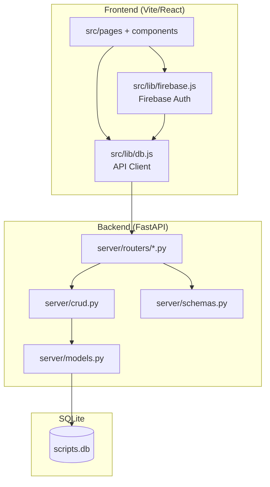
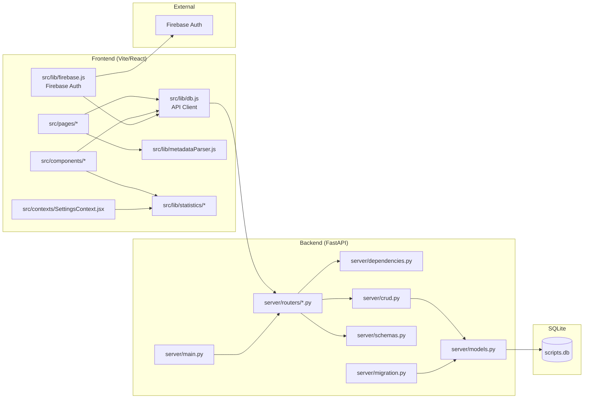
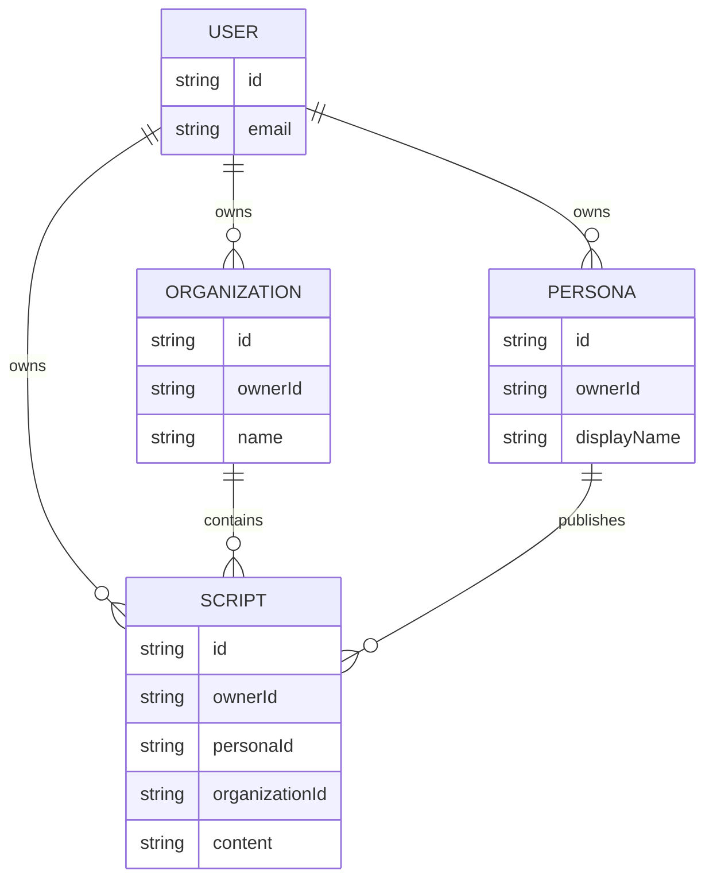

# 系統架構圖（Mermaid）

以下架構圖提供給新加入成員快速理解系統組成與資料走向。

## 1. 高階架構（前端 / 後端 / DB）


## 4. 完整架構圖（Mermaid）


## 1-a. 高階架構（ASCII）
```
┌──────────────────────────────┐
│ Frontend (Vite/React)         │
│ - src/pages + components      │
│ - src/lib/db.js (API Client)  │
│ - src/lib/firebase.js (Auth)  │
└───────────────┬──────────────┘
                │ HTTP (X-User-ID)
                ▼
┌──────────────────────────────┐
│ Backend (FastAPI)             │
│ - server/routers/*.py         │
│ - server/crud.py              │
│ - server/models.py            │
│ - server/schemas.py           │
└───────────────┬──────────────┘
                │ SQLAlchemy
                ▼
┌──────────────────────────────┐
│ SQLite (scripts.db)           │
└──────────────────────────────┘
```

## 2. Public vs Studio 路徑
```mermaid
flowchart LR
  subgraph Public
    PG[src/pages/PublicGalleryPage.jsx]
    PR[src/pages/PublicReaderPage.jsx]
    PG -->|getPublicScripts| API[src/lib/db.js]
    PR -->|getPublicScript| API
    API -->|/api/public-*| PUB[server/routers/public.py]
  end

  subgraph Studio
    DASH[src/pages/PublisherDashboard.jsx]
    META[src/components/dashboard/ScriptMetadataDialog.jsx]
    DASH -->|getPersonas/getOrganizations|get| API
    META -->|getScript/updateScript| API
    API -->|/api/scripts| SCRIPTS[server/routers/scripts.py]
    API -->|/api/personas| PERSONAS[server/routers/personas.py]
    API -->|/api/organizations| ORGS[server/routers/orgs.py]
  end
```

## 2-a. Public vs Studio 路徑（ASCII）
```
Public:
  PublicGalleryPage.jsx
      └─ db.js:getPublicScripts/getPublicPersonas/getPublicOrganizations
          └─ public.py (/api/public-*)

  PublicReaderPage.jsx
      └─ db.js:getPublicScript
          └─ public.py (/api/public-scripts/{id})

Studio:
  PublisherDashboard.jsx
      └─ db.js:getPersonas/getOrganizations/getUserScripts
          └─ personas.py / orgs.py / scripts.py

  ScriptMetadataDialog.jsx
      └─ db.js:getScript/updateScript
          └─ scripts.py
```

## 3. 資料模型關聯（簡化）


## 3-a. 資料模型關聯（ASCII）
```
User ── owns ── Script
User ── owns ── Persona
User ── owns ── Organization
Organization ── contains ── Script
Persona ── publishes ── Script
```
