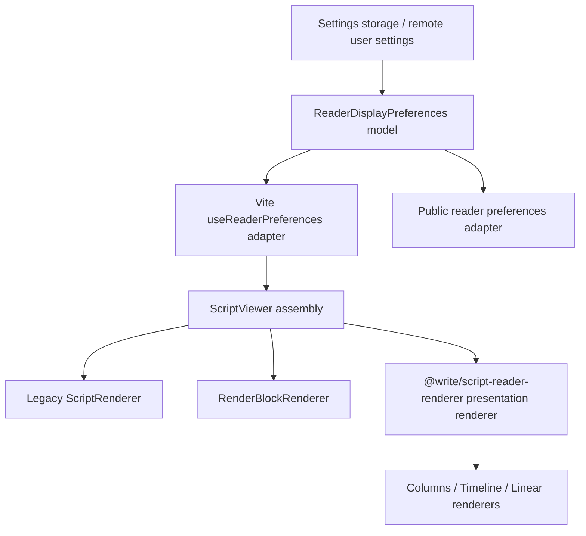

# Reader Display Preferences Architecture

Status: Planned  
Scope: Vite workspace editor preview, shared script reader renderer, and future public reader preference parity.

## Problem

Reader display preferences currently cross several boundaries:

- Vite workspace settings live in `src/contexts/SettingsContext.tsx`.
- Editor preview reads those settings through `src/hooks/useReaderPreferences.ts`.
- Vite renderer entry is `src/components/renderer/ScriptViewer.tsx`.
- Legacy/render-model output lives in `ScriptRenderer` and `RenderBlockRenderer`.
- Presentation output lives in `@write/script-reader-renderer`.
- Public reader preferences live in `@write/script-reader-ui` and the Next public app.

This makes settings like line underline, marker display, typography, line height,
and presentation layout easy to drift. A setting may look available in the UI but
only affect one renderer branch. The long-term goal is not to patch each symptom,
but to define one display-preference contract that every renderer branch either
supports explicitly or declares unsupported.

## Non-Goals

- Do not add renderer-specific CSS overrides from app code.
- Do not store display preferences separately per renderer branch.
- Do not add new one-off toggles inside `ScriptViewer` or presentation renderers.
- Do not make Vite public pages canonical again; Vite remains the workspace/editor host.
- Do not treat column structure lines as the same feature as reader line underlines.

## Definitions

| Term | Meaning | Owner |
|---|---|---|
| Reader display preferences | User-facing visual preferences for reading/editing preview | Shared model, consumed by Vite and public reader |
| Typography preferences | Font family, body/dialogue size, line height | Shared preference model |
| Reading guides | Optional visual aids such as horizontal line underline | Shared preference model + renderer support |
| Presentation structure | Multi-column layout, column dividers, track headers, line numbers | Presentation renderer/layout config |
| Marker visibility | Whether marker content/tooltips are visible | Reader state / renderer input |
| Renderer capability | What a renderer branch can render from the preference model | Renderer package |

## Target Architecture



The key rule: `ScriptViewer` is an assembly layer. It may select the renderer
branch, but it should not reinterpret individual display settings. Renderer
branches must receive the same typed display contract and decide only how to
render supported features.

## Preference Model

Create a shared, pure model before adding more UI:

```ts
export interface ReaderDisplayPreferences {
  typography: {
    readingFontFamily: string;
    bodyFontSize: number;
    dialogueFontSize: number;
    lineHeight: number;
  };
  guides: {
    showLineUnderline: boolean;
  };
  markers: {
    showMarkers: boolean;
    hiddenMarkerIds: string[];
  };
  presentation: {
    enabled: boolean;
    showColumnDividers: boolean;
    showLineNumbers: boolean;
    showTrackHeaders: boolean;
  };
}
```

The exact type can be smaller at first, but it must be explicit about feature
ownership:

- `guides.showLineUnderline` controls horizontal reading aid lines.
- `presentation.showColumnDividers` controls column structure dividers.
- `presentation.showLineNumbers` controls source-line gutters.
- `markers.showMarkers` controls marker display/tooltips, not layout structure.

## Renderer Contract

Each renderer must accept a common display-preference input or a clearly named
subset:

| Renderer | Required support |
|---|---|
| `ScriptRenderer` | typography, marker tooltip visibility, horizontal line underline |
| `RenderBlockRenderer` | typography, marker hidden ids, marker tooltip visibility, horizontal line underline |
| `ScriptPresentationRenderer` | typography, marker hidden ids, marker tooltip visibility, guide preferences, presentation structure preferences |
| `ColumnsPresentationRenderer` | horizontal row underline, column dividers, track headers, line numbers |
| `TimelinePresentationRenderer` | typography, marker visibility; structural card borders remain layout unless modeled |
| `LinearPresentationRenderer` | typography, marker visibility; optional guide support if UX requires it |

Unsupported features must be intentional and tested. A renderer must not silently
ignore a user-visible setting unless the capability table marks it unsupported.

## Storage Contract

Long-term storage rules:

- One canonical default object owns every default.
- Vite local storage and remote user settings serialize that object or a stable
  projection of it.
- Public reader storage maps to the same semantic fields.
- Migration, if needed later, belongs at storage boundaries, not inside renderer
  components.

Recommended model:

```ts
export const DEFAULT_READER_DISPLAY_PREFERENCES = {
  typography: {
    readingFontFamily: "serif",
    bodyFontSize: 14,
    dialogueFontSize: 14,
    lineHeight: 1.4,
  },
  guides: {
    showLineUnderline: false,
  },
  markers: {
    showMarkers: true,
    hiddenMarkerIds: [],
  },
  presentation: {
    enabled: true,
    showColumnDividers: true,
    showLineNumbers: true,
    showTrackHeaders: true,
  },
} as const;
```

## UI Contract

The appearance panel should expose settings by semantic group:

1. **閱讀文字**
   - reading font
   - body/dialogue size
   - line height
2. **閱讀輔助**
   - horizontal line underline
   - marker tooltip/display behavior
   - blank-line visibility if retained
3. **多欄版面**
   - enable presentation renderer
   - column dividers
   - line numbers
   - track headers

The UI must not present a setting unless it is wired to every renderer branch
declared as supported by the capability table.

## Execution Plan

### Phase 1 — Contract Matrix ✓ Complete

Goal: Define the full display-preference capability matrix before more UI work.

Tasks:

- Audit current renderer branches and list supported/unsupported preference fields.
- Add a source-level matrix near the shared preference type or in renderer tests.
- Decide whether `TimelinePresentationRenderer` and `LinearPresentationRenderer`
  should support horizontal guide lines or explicitly not support them.
- Decide whether column dividers, line numbers, and track headers become user
  preferences or remain fixed presentation structure.

Definition of Done:

- There is one documented capability table.
- Every existing display preference maps to a renderer contract.
- No UI setting is listed without an owner and supported renderer branches.

Completion notes:

- `packages/script-reader-renderer/src/presentation/rendererCapabilityMatrix.ts`
  is the authoritative source. Uses `CapabilityState = "supported" | "unsupported" |
  "fixed-on" | "n/a"` (not boolean) to distinguish fixed structure from unsupported.
- `ScriptPresentationRenderer` capability is expressed as a per-mode map
  (`AggregateCapability`) rather than a flat union, to preserve conditional
  `showLineUnderline` semantics across columns / timeline / linear paths.
- Host-owned renderer branches (ScriptRenderer, RenderBlockRenderer) are described
  in `src/types/rendererCapabilityMatrix.ts` (Vite app), not in the shared package.
- Decisions: Timeline and Linear do not support `showLineUnderline` (explicit,
  tested). Column dividers, line numbers, and track headers remain fixed
  presentation structure; no user preferences added.

### Phase 2 — Shared Preference Model ✓ Complete

Goal: Replace loose preference objects with a typed shared model.

Tasks:

- Create `ReaderDisplayPreferences` and defaults in a shared location.
- Add validators/normalizers for persisted values.
- Update `useReaderPreferences` to return the shared model or a stable adapter.
- Keep `SettingsContext` as storage/orchestration, not the source of renderer
  semantics.

Definition of Done:

- Defaults are not duplicated across settings context and renderer props.
- Invalid persisted values normalize to the shared default.
- Tests cover defaults, persisted values, and remote settings hydration.

Completion notes:

- `ReaderDisplayPreferences` nested model (typography / guides / markers /
  presentation groups) and `DEFAULT_READER_DISPLAY_PREFERENCES` live in
  `packages/script-reader-renderer/src/presentation/readerDisplayPreferences.ts`,
  exported from the package barrel.
- `normalizeReaderDisplayPreferences` handles invalid/out-of-range persisted
  values; clamps font sizes to [8, 72] and line height to [0.9, 2.4].
- `useReaderPreferences` now returns `ReaderDisplayPreferences`; accepts
  `ReaderDisplayPreferencesInput` overrides (explicit deep-partial type, not a
  generic `DeepPartial`). Both storage values and caller overrides pass through
  `normalizeReaderDisplayPreferences` — invalid values from either source are
  caught by the same rules. SettingsContext remains the storage/orchestration
  layer; this hook is the adapter.
- The old flat `src/types/readerPreferences.ts` file has been removed.
- Consumers (`PreviewPanel`, `ScriptMetadataDialog`) flatten the nested model
  to ScriptViewer flat props at the call site; ScriptViewer API stays flat
  until Phase 3.
- Tests: `readerDisplayPreferences.test.ts` (9 tests — defaults, normalization,
  clamping, partial overrides); `useReaderPreferences.test.ts` (6 tests —
  storage mapping, overrides, remote hydration).

### Phase 3 — Renderer API Convergence ✓ Complete

Goal: Every renderer branch consumes the same preference semantics.

Tasks:

- Update `ScriptViewer` to pass one display-preference object or typed subsets.
- Update `ScriptRenderer`, `RenderBlockRenderer`, and presentation renderer APIs.
- Move renderer-specific interpretation into the owning renderer package.
- Add package-level tests for each supported preference.

Definition of Done:

- Switching renderer branch does not change preference semantics.
- `showLineUnderline=false` means no horizontal guide lines in branches that
  declare `showLineUnderline: "supported"` in the capability matrix (ScriptRenderer,
  RenderBlockRenderer, ColumnsPresentationRenderer).
- `showLineUnderline=true` means horizontal guide lines appear in those same
  supported branches. Timeline and Linear presentation modes remain unsupported
  per the Phase 1 capability matrix — passing the flag has no visible effect.
- Column dividers are controlled separately from line underlines.

Completion notes:

- `ScriptViewer` now accepts `displayPreferences?: ReaderDisplayPreferences`.
  Each renderer branch (ScriptRenderer, RenderBlockRenderer, ScriptRendererV2/
  ColumnsPresentationRenderer) resolves its values from `displayPreferences`
  when set, with flat props as explicit override (backward compat for
  `ScriptSurface` viewerProps spread).
- Resolution order: `flatProp ?? displayPreferences?.group.field ?? hardcoded-default`.
- `PreviewPanel` and `ScriptMetadataDialog` now pass `displayPreferences` directly
  instead of manually flattening each field. The flatten boilerplate is removed.
- `usePresentationRenderer` and `presentationLayoutConfig` are explicit flat props (host-selection
  concerns, not in `ReaderDisplayPreferences`). Renamed from `useV2Renderer`/`v2LayoutConfig` in Phase 3b.
- Tests: 5 new tests in `ScriptViewer.test.tsx` covering `displayPreferences`
  wiring to render-block-renderer, presentation renderer (columns), and legacy ScriptRenderer; flat
  prop override precedence verified.

### Phase 4 — Appearance Panel Restructure ✓ Complete

Goal: UI matches the semantic model.

Tasks:

- Split appearance settings into Reading Text, Reading Guides, and Presentation Layout. ✓
- Disable or hide settings that are unsupported in the active renderer mode. → deferred to Phase 6 (requires runtime mode detection; capability matrix is defined but not yet wired to UI gating).
- Make all interactive controls in `AppearanceSettings` accessible (`button type="button"`, `aria-pressed` or switch semantics). ✓
- Provide short labels that distinguish horizontal guide lines from column dividers. ✓

Definition of Done:

- Users can predict what each setting affects. ✓
- Changing a setting updates the active preview immediately. ✓ (SettingsContext is reactive)
- Reload preserves the same values. ✓ (usePersistentState)

Completion notes:

- `AppearanceSettings` restructured into three `SettingsSectionCard` sections:
  1. **閱讀文字 / Reading Text** — font family, size presets, line height (with advanced sliders).
  2. **閱讀輔助 / Reading Guides** — `showMarkers` (Switch) + `showLineUnderline` (toggle button).
     Label "行底線輔助 / Line Guide" explicitly names the horizontal reading aid, distinct from column dividers.
  3. **多欄版面 / Presentation Layout** — `usePresentationRenderer` toggle.
     Description links to Marker Settings for column routing/widths (capability boundary explicit).
- All buttons in `AppearanceSettings` now have `type="button"` and `aria-pressed` where applicable:
  font size presets, line height presets, desktop scale presets, theme (light/dark), accent swatches,
  `showLineUnderline` toggle, `usePresentationRenderer` toggle.
- `showMarkers` uses `<Switch aria-label={t("appearance.showMarkers")}>` (Radix switch role; explicit label required because the adjacent `<span>` is not a `<label>`).
- Capability-aware gating (hide `showLineUnderline` when renderer is timeline/linear) deferred:
  requires runtime mode from `ScriptViewer` or `SettingsContext`; no cross-cutting signal exists yet.
  Tracked in Phase 6 QA contract scenarios.
- `usePresentationRenderer` also remains in MarkerSettings header as contextual shortcut; AppearanceSettings is the canonical home.
- i18n keys added: `readingText`, `readingTextDesc`, `readingGuides`, `readingGuidesDesc`,
  `presentationLayout`, `presentationLayoutDesc`, `presentationLayoutEnabled`, `presentationLayoutEnabledDesc` (zh-TW, en, ja).

### Phase 5 — Public Reader Parity ✓ Complete

Goal: Public reader preference semantics are explicitly mapped to the shared `ReaderDisplayPreferences` model, with divergences and gaps documented and locked by tests.

Note: The public reader render path does not use `ReaderDisplayPreferences` directly. It uses the flat `PublicAppearancePreferences` model, bridged to the renderer via `ScriptContentRenderer` flat props. Phase 5 establishes the cross-model semantic contract and documents gaps; it does not unify the runtime models.

Tasks:

- Map public reader preferences to `ReaderDisplayPreferences`. ✓ (adapter already existed; field mapping documented)
- Confirm Next reader storage uses the same field names or an explicit adapter. ✓
- Add parity tests for typography and guide preferences between public reader and editor preview. ✓

Definition of Done:

- Cross-model semantic contract is explicit and tested. ✓
- Divergences between public reader defaults and shared model defaults are locked by inline snapshots. ✓
- Gaps (missing fields in public reader) are documented and tested. ✓
- Adapters are explicit where storage keys differ. ✓

Completion notes:

- Public reader uses `PublicAppearancePreferences` (`readerFontSize`, `readerLineHeight`, `readerFontFamily`).
  Vite editor uses `ReaderDisplayPreferences` (`typography.bodyFontSize`, `typography.lineHeight`, `typography.readingFontFamily`).
- Adapter: `apps/public/lib/createAppearanceReaderStorage.ts` — bridges `useReaderState`'s
  `reader:preferences` storage key to `publicAppearancePreferences` model. Already tested (11 tests).
- Parity tests added: `apps/public/lib/readerDisplayPreferencesParity.test.ts` (8 tests).
  These lock the cross-model semantic contract and document divergences and gaps explicitly:
  - **Font size divergence**: public default 16, Vite default 14 (intentional — public targets comfortable reading).
  - **Line height divergence**: public default 1.8, Vite default 1.4 (same reason).
  - **`showLineUnderline` gap**: absent from `PublicAppearancePreferences` — no UI or storage in public reader.
  - **`showMarkers` gap**: absent from `PublicAppearancePreferences` — no UI or storage in public reader.
  - **`presentation.enabled` gap**: not applicable — public reader always uses `ScriptPresentationRenderer`.
- Font family: public reader restricts to enum `["sans", "serif", "mono"]`; shared model accepts any string.
  Public reader enum is a valid subset. Confirmed by parity test.
- Single public `readerFontSize` emits `delta.fontSize` via the adapter; `ScriptPresentationRenderer`
  uses that single `fontSize` prop for all presentation text. It does not produce separate
  `bodyFontSize`/`dialogueFontSize` fields. Locked by parity test.

### Phase 6 — QA Contract ✓ Complete

Goal: Prevent regression across renderer modes.

Required scenarios:

- New user defaults: horizontal line underline off. ✓ (`readerDisplayPreferences.test.ts`)
- Legacy renderer: underline off/on works. ✓ (`ScriptViewer.test.tsx` — ScriptRenderer spy)
- Render model renderer: underline off/on works. ✓ (`ScriptViewer.test.tsx` — `show-line-underline` class)
- Presentation columns: horizontal guide off/on works. ✓ (`ScriptViewer.test.tsx` — `data-line-underlines`)
- Presentation columns: column dividers remain separate from horizontal guide. ✓ (`ScriptPresentationRenderer.test.tsx` — `[data-track-id]` header cell count unchanged across both underline states)
- Presentation linear/timeline: behavior matches capability table. ✓ (`ScriptPresentationRenderer.test.tsx` — no `data-line-underlines` attr when unsupported)
- Settings panel toggle updates preview without reload. ✓ (SettingsContext reactive; `AppearanceSettings.test.tsx` verifies click → setter call)
- Reload persists user choice. ✓ (`SettingsContext.test.tsx` — usePersistentState storage key wiring)

Capability-aware gating:

- `AppearanceSettings` gates the `showLineUnderline` toggle at config level: when `usePresentationRenderer=true` and `presentationLayoutConfig.renderMode === "timeline"`, the button is `aria-disabled`, `cursor-not-allowed`, and click has no effect.
- `lineGuideUnsupported` i18n key added (zh-TW, en, ja) for the `title` tooltip on the disabled button.
- Tests: `AppearanceSettings.test.tsx` (6 tests — enabled/disabled states, click suppression, aria-pressed when gated).
- `useIsMobileViewport` extracted from `ScriptPresentationRenderer` internals into `packages/script-reader-renderer/src/presentation/useIsMobileViewport.ts`, exported from the package barrel. Used by both `ScriptPresentationRenderer` (refactored to import it) and `AppearanceSettings`.
- Effective mode = `isMobileViewport ? "linear" : presentationLayoutConfig.renderMode`. Mobile viewport (auto-linear) is now gated alongside configured-timeline.
- Tests: 2 new tests in `AppearanceSettings.test.tsx` — mobile viewport disables toggle even when config is columns; click suppressed on mobile.

## Recommended Next Step

All planned implementation phases complete. No open implementation tasks.
