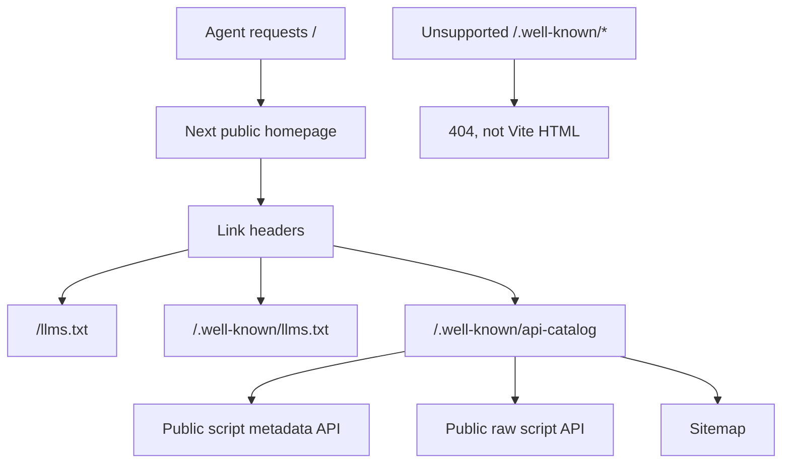

# Public Agent Discovery Plan

Status: planned  
Last updated: 2026-07-01

## Context

The public site already exposes useful crawler and AI-agent entry points:

- `/robots.txt` with AI bot rules and content signals
- `/llms.txt`
- `/.well-known/llms.txt`
- `/sitemap.xml`
- public read/entity routes such as `/read/[id]`, `/author/[id]`, `/org/[id]`, `/series/[name]`, `/tag/[name]`
- public script API endpoints under `/api/public-scripts/`

An agent discovery scan still reports missing or malformed signals:

- homepage response has no RFC 8288 `Link` headers
- `/.well-known/api-catalog` returns HTML instead of `application/linkset+json`
- unsupported `/.well-known/*` paths return a Vite/HTML soft-404
- `Accept: text/markdown` still returns HTML
- DNS-AID, OAuth/OIDC, MCP, WebMCP, agent skills, and commerce discovery are absent

This plan separates useful discovery work from protocols that would currently be misleading.

## Principles

1. **No fake capabilities.** Do not publish OAuth, MCP, WebMCP, payment, or agent skill documents unless the product actually supports those interfaces.
2. **No HTML soft-404 for machine endpoints.** Unsupported `/.well-known/*`, `/openapi.json`, `/auth.md`, and similar probe paths should return a real 404 or a deliberate machine-readable document.
3. **Agent discovery points to stable public resources.** Link headers and catalogs should advertise public reading and metadata endpoints, not internal admin routes.
4. **Keep discovery owned by the public surface.** Next public app should own public discovery documents where possible; nginx should only route and prevent SPA fallback leaks.
5. **Preserve browser defaults.** Discovery improvements must not add client JavaScript to normal page loads.

## Findings

### F1 — Homepage Missing Link Headers

`GET /` returns 200 HTML but no `Link` response header. Agents that inspect response headers do not discover `/llms.txt`, `/.well-known/llms.txt`, or a future API catalog.

### F2 — API Catalog Missing

`GET /.well-known/api-catalog` returns `200 text/html`, because the request falls through to the Vite SPA fallback. The endpoint should either exist as `application/linkset+json` or return a real 404.

### F3 — Well-Known Soft 404

Unsupported machine endpoints currently return HTML:

- `/.well-known/api-catalog`
- `/.well-known/openid-configuration`
- `/.well-known/oauth-authorization-server`
- `/.well-known/oauth-protected-resource`
- `/.well-known/mcp/server-card.json`
- `/.well-known/mcp.json`
- `/.well-known/agent-skills/index.json`

This is worse than a missing endpoint because scanners interpret it as a malformed discovery document.

### F4 — Markdown Negotiation Missing

`Accept: text/markdown` for `/` still receives `text/html`. This is optional. The safer long-term approach is to publish explicit markdown endpoints first, then decide whether content negotiation is needed.

### F5 — Experimental or Inapplicable Protocols

The scan also asks for:

- DNS-AID
- OAuth/OIDC discovery
- OAuth protected resource metadata
- Auth.md
- MCP Server Card
- Agent Skills index
- WebMCP
- x402 / MPP / UCP / ACP commerce discovery

These should remain absent until the site actually exposes those capabilities.

## Target Architecture



## Phase 1 — Stop Machine Endpoint Soft-404s

Owner: nginx + Next public route boundaries

Tasks:

- Add explicit routing for supported well-known files:
  - `/.well-known/llms.txt`
  - `/.well-known/api-catalog`
- Ensure unsupported `/.well-known/*` paths return 404.
- Ensure `/openapi.json`, `/auth.md`, and unsupported discovery probe paths do not fall through to Vite `index.html`.

Suggested nginx rule:

```nginx
location ^~ /.well-known/ {
  proxy_pass http://$public:3000;
  proxy_set_header Host $host;
  proxy_set_header X-Real-IP $remote_addr;
  proxy_set_header X-Forwarded-For $proxy_add_x_forwarded_for;
  proxy_set_header X-Forwarded-Proto $scheme;
}
```

Then let Next return:

- 200 for deliberate supported documents
- 404 for unsupported documents

Do not route all unknown well-known paths to Vite.

Acceptance:

- `curl -I https://open-scripts.shawnup.com/.well-known/api-catalog` is not `text/html` once implemented.
- `curl -I https://open-scripts.shawnup.com/.well-known/not-real` returns 404.
- Unsupported discovery paths no longer return Vite HTML.

## Phase 2 — Add API Catalog

Owner: Next public app

Create:

- `apps/public/app/.well-known/api-catalog/route.ts`

Return:

- `Content-Type: application/linkset+json`
- A RFC 9727-style `linkset` document

Initial catalog should advertise only stable public resources:

- public script metadata API: `/api/public-scripts/{script_id}`
- public raw script content API: `/api/public-scripts/{script_id}/raw`
- sitemap: `/sitemap.xml`
- AI guide: `/llms.txt` and `/.well-known/llms.txt`

Example shape:

```json
{
  "linkset": [
    {
      "anchor": "https://open-scripts.shawnup.com/api/public-scripts/{script_id}",
      "service-doc": [
        {
          "href": "https://open-scripts.shawnup.com/llms.txt",
          "type": "text/plain"
        }
      ],
      "item": [
        {
          "href": "https://open-scripts.shawnup.com/api/public-scripts/{script_id}/raw",
          "type": "text/plain"
        }
      ]
    }
  ]
}
```

Acceptance:

- `GET /.well-known/api-catalog` returns 200.
- Response `Content-Type` is `application/linkset+json` or compatible JSON.
- The response does not include dashboard/admin/private endpoints.
- Unit test validates content type and core links.

## Phase 3 — Add RFC 8288 Link Headers

Owner: Next public app

Add response headers for the homepage and key public pages.

Recommended `Link` values for `/`:

```http
Link: </llms.txt>; rel="service-doc"; type="text/plain"
Link: </.well-known/llms.txt>; rel="service-doc"; type="text/plain"
Link: </.well-known/api-catalog>; rel="api-catalog"; type="application/linkset+json"
Link: </sitemap.xml>; rel="sitemap"; type="application/xml"
```

Implementation options:

- Prefer `headers()` in `apps/public/next.config.ts` for public route patterns.
- Use nginx only if headers must also apply to non-Next static files.

Candidate route patterns:

- `/`
- `/read/:path*`
- `/author/:path*`
- `/org/:path*`
- `/series/:path*`
- `/tag/:path*`
- `/about`
- `/help`
- `/license`

Acceptance:

- `curl -I /` includes `Link`.
- `curl -I /read/{id}` includes `Link`.
- No dashboard/admin routes receive misleading public API catalog headers.

## Phase 4 — Update llms.txt

Owner: static public files

Update both:

- `public/llms.txt`
- `public/.well-known/llms.txt`

Add:

- API catalog URL
- sitemap URL
- raw content endpoint
- structured metadata endpoint
- note that unsupported machine protocols are not currently exposed

Acceptance:

- Both llms files remain byte-for-byte intentionally aligned, unless a future reason requires divergence.
- `scripts/verify-public-seo.mjs` still passes llms checks.

## Phase 5 — Optional Markdown Endpoints

Owner: Next public app

Do not start with automatic `Accept: text/markdown` negotiation. Prefer explicit markdown routes first:

- `/index.md`
- `/about.md`
- optional future `/read/[id].md`

Only add content negotiation later if:

- it can be done without adding client JS
- it does not alter browser defaults
- cache headers vary correctly on `Accept`

Acceptance if implemented:

- `GET /index.md` returns `text/markdown`.
- `GET /` still returns HTML by default.
- If negotiation is added, `Vary: Accept` is present.

## Deferred / Explicit Non-Goals

Do not implement these until the product actually has matching capabilities:

- OAuth / OIDC discovery
- OAuth Protected Resource Metadata
- `auth.md` agent registration
- MCP Server Card
- WebMCP
- Agent Skills index
- x402 / MPP / UCP / ACP commerce discovery

DNS-AID is also deferred. It requires Cloudflare DNS configuration, SVCB/HTTPS records, and ideally DNSSEC. This should be evaluated separately after HTTP discovery is correct.

## Verification Commands

```bash
curl -I https://open-scripts.shawnup.com/
curl -I https://open-scripts.shawnup.com/.well-known/api-catalog
curl -s https://open-scripts.shawnup.com/.well-known/api-catalog | jq .
curl -I https://open-scripts.shawnup.com/.well-known/not-real
curl -I https://open-scripts.shawnup.com/auth.md
curl -I https://open-scripts.shawnup.com/openapi.json
curl -s https://open-scripts.shawnup.com/llms.txt | head -40
```

Expected after implementation:

- homepage has `Link` headers
- API catalog returns JSON
- unsupported machine discovery paths return 404, not HTML
- llms files mention API catalog

## Definition of Done

- [ ] Unsupported `/.well-known/*` paths no longer soft-404 to Vite HTML
- [ ] `/.well-known/api-catalog` returns `application/linkset+json`
- [ ] Homepage has RFC 8288 `Link` headers
- [ ] Public read/entity pages have relevant `Link` headers
- [ ] `llms.txt` files mention API catalog
- [ ] Tests cover API catalog response and headers
- [ ] Verification script checks Link headers and API catalog
- [ ] Agent discovery scanner no longer reports malformed HTML for supported endpoints

