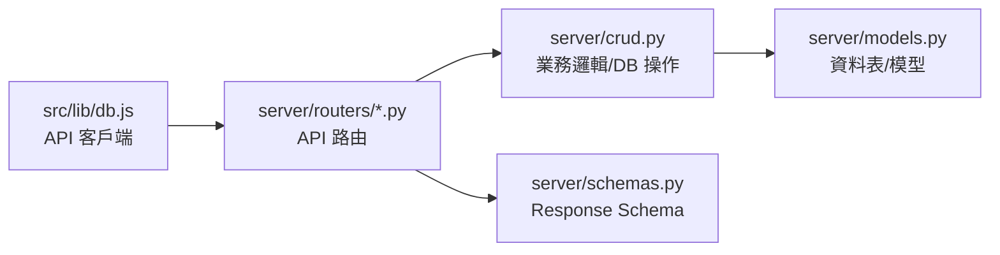
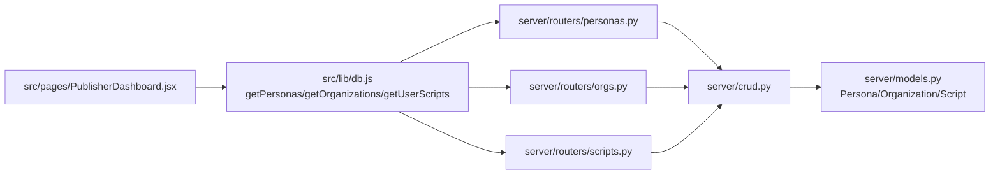
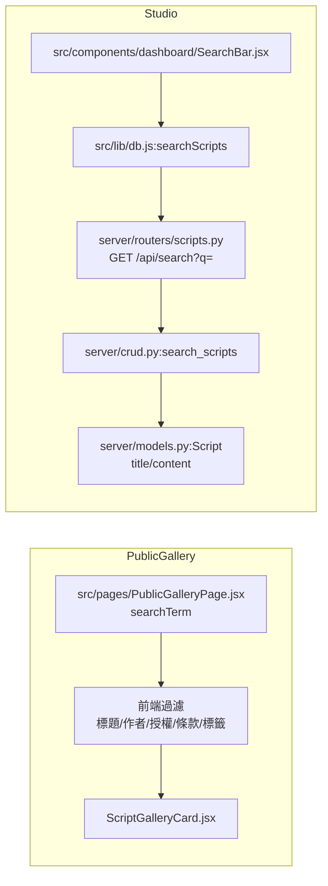
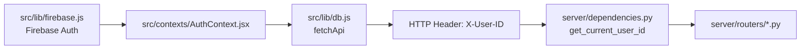
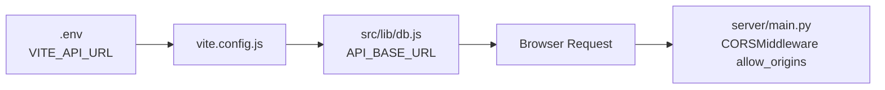
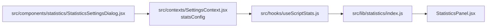

# 核心與功能資料流（檔案到檔案）

本文件整理「核心資料流」與「各功能資料流」的走向，描述資料從前端到後端、以及在後端的路徑。重點放在「從什麼檔案到什麼檔案」。

## Mermaid 圖表（各功能資料流 + 主要資料）

### 核心資料流（前端 → 後端 → DB）


```
核心資料流（ASCII）
db.js (API Client)
   └─> routers/*.py (API routes)
         └─> crud.py (DB logic)
               └─> models.py (DB models)
         └─> schemas.py (response)
```

### 公開作品列表（Public Gallery）
```mermaid
flowchart LR
  A[src/pages/PublicGalleryPage.jsx\n搜尋/排序/篩選] --> B[src/lib/db.js:getPublicScripts]
  A --> C[src/lib/db.js:getPublicPersonas]
  A --> D[src/lib/db.js:getPublicOrganizations]
  B --> E[server/routers/public.py\nGET /api/public-scripts]
  C --> F[server/routers/public.py\nGET /api/public-personas]
  D --> G[server/routers/public.py\nGET /api/public-organizations]
  E --> H[server/crud.py:get_public_scripts]
  H --> I[server/models.py:Script\n(含 persona/org/tags)]
```

```
Public Gallery（ASCII）
PublicGalleryPage.jsx
  ├─> db.js:getPublicScripts → public.py:/public-scripts → crud.py:get_public_scripts → Script
  ├─> db.js:getPublicPersonas → public.py:/public-personas → Persona
  └─> db.js:getPublicOrganizations → public.py:/public-organizations → Organization
```

### 公開作品閱讀頁（Public Reader）
```mermaid
flowchart LR
  A[src/pages/PublicReaderPage.jsx] --> B[src/lib/db.js:getPublicScript]
  B --> C[server/routers/public.py\nGET /api/public-scripts/{id}]
  C --> D[server/models.py:Script\ncontent,tags,persona,org]
  A --> E[src/lib/metadataParser.js\nextractMetadataWithRaw]
  A --> F[src/components/reader/PublicReaderLayout.jsx]
  F --> G[src/components/reader/PublicScriptInfoOverlay.jsx]
```

```
Public Reader（ASCII）
PublicReaderPage.jsx
  ├─> db.js:getPublicScript → public.py:/public-scripts/{id}
  ├─> metadataParser.extractMetadataWithRaw
  └─> PublicReaderLayout → PublicScriptInfoOverlay
```

### 工作室（Dashboard / Studio）


```
Studio（ASCII）
PublisherDashboard.jsx
  ├─> db.js:getPersonas → personas.py → crud.py → Persona
  ├─> db.js:getOrganizations → orgs.py → crud.py → Organization
  └─> db.js:getUserScripts → scripts.py → crud.py → Script
```

### 編輯劇本資訊（Metadata）
```mermaid
flowchart LR
  A[src/components/dashboard/ScriptMetadataDialog.jsx] --> B[src/lib/db.js:getScript]
  B --> C[server/routers/scripts.py\nGET /api/scripts/{id}]
  A --> D[src/lib/metadataParser.js\nextractMetadataWithRaw]
  A --> E[src/lib/metadataParser.js\nwriteMetadata]
  A --> F[src/lib/db.js:updateScript]
  F --> G[server/routers/scripts.py\nPUT /api/scripts/{id}]
  G --> H[server/crud.py:update_script]
```

```
Metadata（ASCII）
ScriptMetadataDialog.jsx
  ├─> db.js:getScript → scripts.py:GET /api/scripts/{id}
  ├─> metadataParser.extractMetadataWithRaw
  ├─> metadataParser.writeMetadata
  └─> db.js:updateScript → scripts.py:PUT /api/scripts/{id} → crud.py:update_script
```

### 統計分析（Stats）
```mermaid
flowchart LR
  A[src/components/statistics/StatisticsPanel.jsx] --> B[src/hooks/useScriptStats.js]
  B --> C[src/lib/statistics/index.js]
  C --> D[src/lib/statistics/metrics/*]
  B --> E[server/routers/analysis.py\nGET /api/analysis/script/{id}]
  E --> F[server/analysis/analyzer.py]
```

```
Stats（ASCII）
StatisticsPanel.jsx
  └─> useScriptStats.js → statistics/index.js → metrics/*
  └─> analysis.py:/api/analysis/script/{id} → analysis/analyzer.py
```

### 組織邀請 / 申請
```mermaid
flowchart LR
  A[src/components/dashboard/publisher/PublisherOrgTab.jsx] --> B[src/lib/db.js\ninviteOrganizationMember/requestToJoinOrganization]
  B --> C[server/routers/orgs.py\nPOST /organizations/{id}/invite\nPOST /organizations/{id}/request]
  C --> D[server/crud.py\ncreate_organization_invite/request]
  D --> E[server/models.py\nOrganizationInvite/OrganizationRequest]
```

```
Org Invites/Requests（ASCII）
PublisherOrgTab.jsx
  ├─> db.js:inviteOrganizationMember → orgs.py:/invite → crud.py:create_organization_invite
  └─> db.js:requestToJoinOrganization → orgs.py:/request → crud.py:create_organization_request
```

### 作品移轉 / 作者移轉 / 組織移轉
```mermaid
flowchart LR
  A[src/lib/db.js\ntransferScriptOwnership/transferPersonaOwnership/transferOrganizationOwnership]
  A --> B[server/routers/scripts.py|personas.py|orgs.py]
  B --> C[server/crud.py:transfer_*]
  C --> D[server/models.py\nScript/Persona/Organization]
```

```
Transfers（ASCII）
db.js:transfer* → scripts.py/personas.py/orgs.py → crud.py:transfer_* → models.py
```

### 公開作者 / 組織頁
```mermaid
flowchart LR
  A[src/pages/AuthorProfilePage.jsx] --> B[src/lib/db.js:getPublicPersona]
  A --> C[src/lib/db.js:getPublicScripts]
  B --> D[server/routers/public.py\nGET /api/public-personas/{id}]
  C --> E[server/routers/public.py\nGET /api/public-scripts]
  D --> F[server/models.py:Persona]
  E --> G[server/models.py:Script]
```

```
Public Author/Org（ASCII）
AuthorProfilePage.jsx → db.js:getPublicPersona → public.py:/public-personas/{id}
AuthorProfilePage.jsx → db.js:getPublicScripts → public.py:/public-scripts
OrganizationPage.jsx → db.js:getPublicOrganization → public.py:/public-organizations/{id}
```

### 搜尋流程（Public Gallery + Studio）


```
Search（ASCII）
PublicGalleryPage.jsx → 前端過濾（標題/作者/授權/條款/標籤）
SearchBar.jsx → db.js:searchScripts → scripts.py:/api/search → crud.py:search_scripts
```

### 授權流程（Metadata → Public 顯示）
```mermaid
flowchart LR
  A[src/components/dashboard/ScriptMetadataDialog.jsx] --> B[src/lib/metadataParser.js\nwriteMetadata]
  B --> C[script.content\nTitlePage: License/LicenseUrl/LicenseTerms]
  A --> D[src/lib/db.js:updateScript]
  D --> E[server/routers/scripts.py\nPUT /api/scripts/{id}]
  E --> F[server/crud.py:update_script]
  F --> G[server/models.py:Script.content]
  G --> H[src/pages/PublicReaderPage.jsx\nextractMetadataWithRaw]
  H --> I[src/components/reader/PublicScriptInfoOverlay.jsx\nLicense/Terms 顯示]
```

```
License Flow（ASCII）
ScriptMetadataDialog.jsx → writeMetadata → script.content
updateScript → scripts.py → crud.py:update_script → Script.content
PublicReaderPage.jsx → extractMetadataWithRaw → PublicScriptInfoOverlay
```

### 登入 / 授權（Firebase Auth → API Header）


```
Auth（ASCII）
firebase.js → AuthContext → db.js:fetchApi → Header: X-User-ID
server/dependencies.py:get_current_user_id → routers
```

### CORS / 環境變數（前端 API 指向）


```
CORS（ASCII）
.env (VITE_API_URL) → vite.config.js → db.js:API_BASE_URL
Browser → server/main.py CORSMiddleware allow_origins
```

### 統計設定流程（Settings → Stats）


```
Stats Settings（ASCII）
StatisticsSettingsDialog.jsx → SettingsContext(statsConfig)
→ useScriptStats.js → statistics/index.js → StatisticsPanel.jsx
```

### 搜尋申請加入組織流程
```mermaid
flowchart LR
  A[PublisherProfileTab.jsx\n搜尋組織] --> B[src/lib/db.js:searchOrganizations]
  B --> C[server/routers/orgs.py\nGET /organizations/search]
  A --> D[src/lib/db.js:requestToJoinOrganization]
  D --> E[server/routers/orgs.py\nPOST /organizations/{id}/request]
  E --> F[server/crud.py:create_organization_request]
```

```
Org Join Request（ASCII）
PublisherProfileTab.jsx → searchOrganizations → orgs.py:/organizations/search
PublisherProfileTab.jsx → requestToJoinOrganization → orgs.py:/organizations/{id}/request
```

## 核心資料流（前端 → 後端 → DB）

1. 前端 API 入口  
`src/lib/db.js` 統一封裝 API 呼叫，提供給各頁面與元件使用。

2. 後端 API 入口  
`server/main.py` 設定 FastAPI 與路由。  
`server/routers/*.py` 實作 API endpoints。

3. 後端資料層  
`server/crud.py` 實作 DB 存取與業務邏輯。  
`server/models.py` 定義資料庫模型。  
`server/schemas.py` 定義 Pydantic 回傳結構。  
`server/database.py` DB 連線。  
`server/migration.py` DB schema migration。

## 功能資料流

### 1. 公開作品列表（Public Gallery）
1. `src/pages/PublicGalleryPage.jsx`  
呼叫 `src/lib/db.js:getPublicScripts()`、`getPublicPersonas()`、`getPublicOrganizations()`  
做搜尋與排序（前端）後渲染卡片。
2. `src/components/gallery/GalleryFilterBar.jsx`  
負責搜尋與排序 UI。
3. `src/components/gallery/ScriptGalleryCard.jsx`  
渲染公開作品卡片。
4. `server/routers/public.py`  
`GET /api/public-scripts`、`/public-personas`、`/public-organizations`
5. `server/crud.py:get_public_scripts()`  
拉取公開作品（含 persona/org）

### 2. 公開作品閱讀頁
1. `src/pages/PublicReaderPage.jsx`  
呼叫 `getPublicScript(id)` 取得內容與 metadata。
2. `src/components/reader/PublicReaderLayout.jsx`  
組合封面、作者、標記說明與正文。
3. `src/components/reader/PublicScriptInfoOverlay.jsx`  
顯示標題、作者、授權、metadata 卡片。
4. `server/routers/public.py`  
`GET /api/public-scripts/{id}`

### 3. 工作室（Dashboard / Studio）
1. `src/pages/PublisherDashboard.jsx`  
載入作者、組織、作品、標籤等資料。
2. `src/components/dashboard/publisher/PublisherWorksTab.jsx`  
作品列表與「編輯資訊」入口。
3. `src/components/dashboard/publisher/PublisherProfileTab.jsx`  
作者身份編輯（含 links、banner、組織）。
4. `src/components/dashboard/publisher/PublisherOrgTab.jsx`  
組織編輯、成員與邀請。
5. `server/routers/personas.py`、`orgs.py`、`scripts.py`、`tags.py`  
提供 CRUD 端點。
6. `server/crud.py`  
處理資料寫入、轉移、成員、邀請、清理等。

### 4. 編輯劇本資訊（Metadata）
1. 入口  
`src/components/dashboard/ScriptMetadataDialog.jsx`  
從 `getScript(id)` 拉最新內容與 metadata，寫回時使用 `writeMetadata()`。
2. Metadata 解析  
`src/lib/metadataParser.js`  
`extractMetadataWithRaw()` / `writeMetadata()`
3. 後端更新  
`server/routers/scripts.py` → `server/crud.py:update_script()`

### 5. 標記 / 解析 / 統計
1. AST 解析  
`src/lib/screenplayAST.js` → `DirectASTBuilder`
2. 統計計算（前端）  
`src/hooks/useScriptStats.js` → `src/lib/statistics/index.js`
3. 統計計算（後端 API）  
`server/routers/analysis.py` → `server/analysis/analyzer.py`
4. 統計面板  
`src/components/statistics/StatisticsPanel.jsx`
5. 統計設定  
`src/components/statistics/StatisticsSettingsDialog.jsx`  
設定保存於 `src/contexts/SettingsContext.jsx`

### 6. 組織邀請 / 申請
1. 前端  
`PublisherOrgTab.jsx` → `db.js:inviteOrganizationMember()` / `requestToJoinOrganization()`  
`PublisherDashboard.jsx` 管理 invite/request list
2. 後端  
`server/routers/orgs.py`  
`/organizations/{id}/invite`、`/request`、`/invites`、`/requests`  
3. DB  
`server/models.py`：`OrganizationInvite`、`OrganizationRequest`  
`server/crud.py`：`create_organization_invite` / `create_organization_request` / accept / decline

### 7. 作品移轉 / 作者移轉 / 組織移轉
1. 前端  
`src/lib/db.js`：`transferScriptOwnership` / `transferPersonaOwnership` / `transferOrganizationOwnership`
2. 後端  
`server/routers/scripts.py` / `personas.py` / `orgs.py`
3. DB  
`server/crud.py:transfer_*`  
含 folder 建立與移轉後更新

### 8. 公開作者 / 組織頁
1. `src/pages/AuthorProfilePage.jsx`  
呼叫 `getPublicPersona` 與 `getPublicScripts`
2. `src/pages/OrganizationPage.jsx`  
呼叫 `getPublicOrganization` 與 `getPublicScripts`
3. `server/routers/public.py`  
`/public-personas/{id}`、`/public-organizations/{id}`

## 補充：主要設定與環境
1. API Base  
`vite.config.js` 與 `.env` `VITE_API_URL`  
`src/lib/db.js` 讀取 `VITE_API_URL`
2. CORS  
`server/main.py` `CORSMiddleware` 設定 allow_origins

## 更新建議
- 若新增欄位，請同步更新：  
`server/models.py` → `server/migration.py` → `server/schemas.py` → 前端表單與顯示
- 若新增 metadata key，請同步更新：  
`src/lib/metadataParser.js` → 讀/寫 → `PublicScriptInfoOverlay.jsx`
