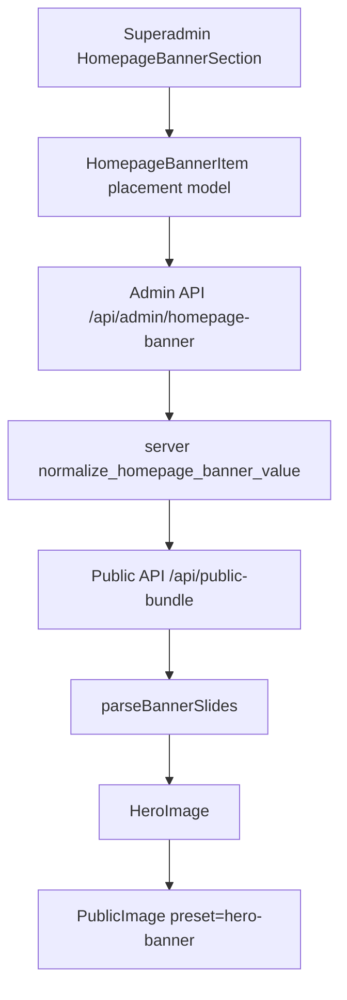

# Homepage Hero Banner Placement Plan

Last updated: 2026-06-25

This document defines the long-term architecture for homepage hero banners.
The goal is to stop treating the hero as a plain `imageUrl` carousel and make
it a first-class media placement with explicit art direction, superadmin
preview, and publish-time validation.

## Current Finding

The homepage black edge is not a carousel CSS leak.

Runtime inspection showed the active hero image fills the hero frame:

- the active banner `` has the same width and height as the slide frame;
- `object-fit: cover` is applied;
- the public bundle currently returns only `imageUrl`;
- it does not return `imageBackgroundMode`, `imageDesktopCrop`, or
  `imageUltraWideCrop`.

Therefore, when a banner still shows a black area at ultra-wide viewport width,
that black area is part of the source image composition or the missing hero
placement data. The fix belongs in the banner data model and superadmin editing
flow, not in per-page CSS.

## Existing System

Already implemented:

- `PublicHeroMarquee` supports a host `renderImage` slot.
- `HeroImage` supports viewport-specific crop fields and `blur-fill`.
- `PublicImage` supports the `hero-banner` preset.
- `parseBannerSlides()` can parse:
  - `imageCrop`
  - `imageMobileCrop`
  - `imageDesktopCrop`
  - `imageUltraWideCrop`
  - `imageBackgroundMode`
  - `imageAlt`

Still incomplete:

- `src/components/admin/HomepageBannerSection.tsx` only edits a generic
  `imageCrop`.
- `src/types/api.ts` exposes `HomepageBannerItem` without the hero placement
  fields.
- `server/utils.py::normalize_homepage_banner_value()` currently preserves only
  `id`, `title`, `content`, `link`, and `imageUrl`.
- Superadmin cannot preview the banner at mobile, desktop, and ultra-wide hero
  sizes before publishing.

## Target Data Contract

`HomepageBannerItem` should store display intent, not just an image URL.

```ts
interface HomepageBannerItem {
  id: string;
  title?: string;
  content?: string;
  link?: string;
  imageUrl?: string;
  imageAlt?: string;
  imageCrop?: MediaCropLike | null;
  imageMobileCrop?: MediaCropLike | null;
  imageDesktopCrop?: MediaCropLike | null;
  imageUltraWideCrop?: MediaCropLike | null;
  imageBackgroundMode?: "cover" | "blur-fill";
}
```

Semantics:

- `imageCrop`: generic fallback crop.
- `imageMobileCrop`: crop used below the mobile breakpoint.
- `imageDesktopCrop`: crop used for ordinary desktop hero.
- `imageUltraWideCrop`: crop used for very wide desktop hero.
- `imageBackgroundMode: "cover"`: primary image crops to fill the frame.
- `imageBackgroundMode: "blur-fill"`: foreground uses contain, with a blurred
  fill layer behind it.
- `imageAlt`: screen-reader description for non-decorative banner images.

The public renderer already follows this resolution order:

```txt
mobile      → imageMobileCrop ?? imageCrop
desktop     → imageDesktopCrop ?? imageCrop
ultra-wide  → imageUltraWideCrop ?? imageDesktopCrop ?? imageCrop
```

## Product Rule

Production hero banners must not rely on implicit center crop.

A slide can be published only when one of these is true:

- it has acceptable previews at mobile, desktop, and ultra-wide sizes; or
- it explicitly uses `blur-fill` for artwork that should not be cropped.

This is stricter than other public image placements because the homepage hero is
full-bleed, first-viewport, and LCP-relevant.

## Superadmin UX

`HomepageBannerSection` should become a hero placement editor.

Each banner item should contain:

- identity fields: title, content, link;
- media field: image URL / upload / media picker;
- alt text field;
- display mode segmented control:
  - `裁切填滿`
  - `模糊補邊`
- three preview tabs:
  - `手機`
  - `桌面`
  - `超寬`
- focal point editing per preview tab;
- readiness indicator for missing or risky placement settings.

The editor should use the same renderer semantics as public pages. It must not
approximate the preview with a different `img` style.

## Preview Sizes

The editor does not need to match every device exactly. It must cover the
failure classes.

Required preview frames:

| Preview | Purpose | Example Frame |
| --- | --- | --- |
| Mobile | confirms vertical crop / subject visibility | 390 x 220 |
| Desktop | confirms normal homepage hero | 1440 x 450 |
| Ultra-wide | catches right/left edge failures | 2560 x 800 |

The ultra-wide preview is mandatory because this is where the current black edge
appears.

## Validation Rules

Save may remain permissive while publish/readiness should be strict.

Warnings:

- no image alt text;
- no ultra-wide crop and mode is `cover`;
- source aspect ratio is far narrower than `16 / 5`;
- selected focal crop places the subject near an edge;
- slide has image but no title/content/link context.

Blocking errors for publish:

- image URL is empty for an image slide;
- `imageBackgroundMode` is missing;
- selected crop data is malformed;
- ultra-wide preview still exposes a visible empty/black side band.

The last rule is primarily a visual QA/readiness rule. It can start as manual
sign-off and later become screenshot-based automation.

## Architecture



Ownership:

- `src/components/admin/HomepageBannerSection.tsx`: editing UI only.
- `src/lib/admin/homepageHeroModel.ts`: pure projection, validation, readiness.
- `src/types/api.ts`: shared TypeScript API contract.
- `server/utils.py`: backend normalization and compatibility.
- `packages/public-ui/src/gallery/bannerModel.ts`: public projection only.
- `apps/public/components/HeroImage.tsx`: public rendering only.

Do not put validation or banner-specific business rules inside
`PublicHeroMarquee`.

## Execution Plan

### Phase 1 — Preserve Placement Data

Status: Done

- Extend `HomepageBannerItem` TypeScript type.
- Extend backend normalization to preserve all hero placement fields.
- Extend admin and public banner API tests.
- Ensure existing rows without placement fields keep working as unconfigured
  legacy data.

Completion criteria:

- saving and reading a banner preserves `imageBackgroundMode` and all crop
  fields;
- `/api/public-bundle` includes the same fields;
- `parseBannerSlides()` receives the data without extra app-level patches.

### Phase 2 — Pure Hero Placement Model

Status: Done

Create a pure model module for superadmin:

```ts
buildHomepageHeroPlacementModel(item): HeroPlacementModel
validateHomepageHeroPlacement(item): HeroPlacementIssue[]
buildHomepageHeroPreviewFrames(item): HeroPreviewFrame[]
```

Completion criteria:

- validation rules are tested without React;
- UI components consume the model instead of re-deriving readiness inline;
- model output maps directly to the public `HeroImage` contract.

### Phase 3 — Superadmin Editor UI

Status: Done

Replace the current single `調整焦點` flow with placement-aware editing:

- display mode segmented control;
- alt text input;
- mobile/desktop/ultra-wide preview tabs;
- per-preview focal crop action;
- readiness/warning panel.

Completion criteria:

- superadmin can see why an image will fail before publishing;
- the ultra-wide preview can reproduce the current black-edge case;
- changing crop/mode updates the preview immediately.

### Phase 4 — Renderer-Parity Preview

Status: Planned

The editor preview should use a shared preview renderer that follows the same
placement contract as `HeroImage`.

Constraints:

- Vite admin cannot import Next `PublicImage`;
- preview may use a plain `` implementation;
- object-fit, object-position, blur-fill, and per-breakpoint crop semantics must
  match public runtime.

Completion criteria:

- public hero and admin preview agree on crop mode;
- no separate preview-only transform math;
- tests cover cover mode and blur-fill mode.

### Phase 5 — Publish Readiness

Status: Planned

Add readiness checks to the superadmin banner section.

Completion criteria:

- incomplete hero placement is visibly marked;
- published banner slides have explicit display mode;
- manual QA checklist includes 390, 1440, and 2560 viewport previews.

### Phase 6 — Optional Automation

Status: Planned

Add screenshot QA only after the manual workflow is stable.

Possible checks:

- render current homepage hero at 2560 width;
- sample right/left edge bands;
- flag mostly-black or mostly-transparent side bands.

This is optional because visual composition cannot be fully solved by pixel
thresholds. The editor preview remains the source of truth.

## Do Not Do

- Do not hard-code `object-position` for the current image.
- Do not add more carousel CSS to hide a data/model problem.
- Do not make all hero images `blur-fill` by default without a stored mode.
- Do not infer `blur-fill` from image aspect ratio silently in production.
- Do not duplicate hero preview math in multiple components.
- Do not treat this as a Next image optimizer problem when the DOM image already
  fills the frame.

## Definition Of Done

This work is complete when:

- superadmin can choose cover vs blur-fill per slide;
- superadmin can set mobile, desktop, and ultra-wide crops;
- backend preserves all hero placement fields;
- public bundle exposes all hero placement fields;
- homepage uses the stored fields without app-level guessing;
- editor preview and public runtime share the same placement semantics;
- ultra-wide QA confirms the current banner no longer shows unintended black
  edge content unless that is intentionally part of the uploaded artwork.

