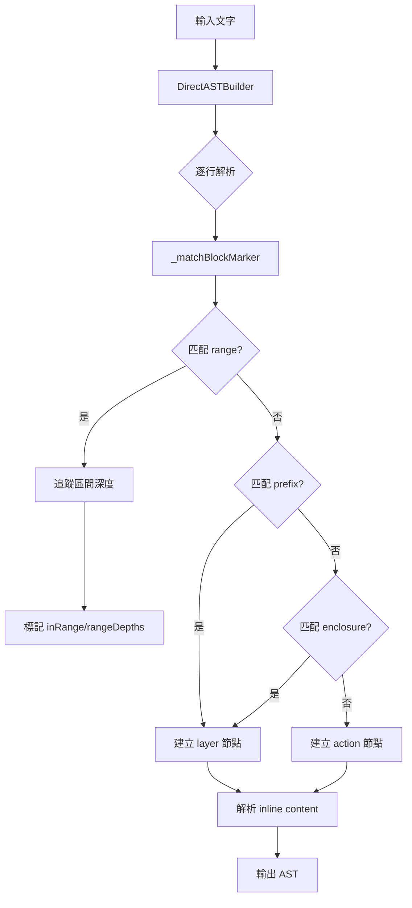

# Marker 設定與解析說明

## 設定面板位置

設定面板組件位於：
- [MarkerDetailEditor.jsx](file:///Users/shanti/project_base/write_project/src/components/settings/marker/MarkerDetailEditor.jsx)
- [MarkerLogicSettings.jsx](file:///Users/shanti/project_base/write_project/src/components/settings/marker/configs/MarkerLogicSettings.jsx)

---

## 匹配模式 (matchMode)

### 1. 包圍模式 (enclosure)
**格式：** `[開始符號]內容[結束符號]`

```javascript
{
  id: 'sound-react',
  start: '|',
  end: '|',
  matchMode: 'enclosure'
}
```
**範例輸入：** `|嬌|`  
**說明：** 適用於單行，開始和結束符號包圍內容

---

### 2. 前綴模式 (prefix)
**格式：** `[前綴]內容`

```javascript
{
  id: 'sfx',
  start: '/sfx',
  matchMode: 'prefix'
}
```
**範例輸入：** `/sfx 門鈴聲`  
**說明：** 行首匹配前綴，後面的內容為 content

---

### 3. 區間模式 (range)
**格式：** 跨行區間，支援巢狀

```javascript
{
  id: 'music-1',
  start: '<cs>',
  end: '</cs>',
  matchMode: 'range',
  // 樣式可自訂，以下是幾種常見選項：
  style: { 
    // 選項 1：左側連接線（推薦）
    borderLeft: '2px solid #4CAF50',
    paddingLeft: '8px',
    
    // 選項 2：背景色
    // backgroundColor: 'rgba(100, 200, 100, 0.1)',
    
    // 選項 3：虛線框
    // borderLeft: '2px dashed #888',
  }
}
```
**範例輸入：**
```
<cs>口交開始，30s
  <cs>低速，10s
    對話內容
  </cs>低速轉中速
</cs>結束
```
**說明：** 
- 巢狀支援：同一組標記可多層嵌套
- 區間內容正常匹配所有其他規則
- 樣式完全自訂（連接線、背景色、邊框等）

---

### 4. 正規式模式 (regex)
**格式：** 自訂正規表達式

```javascript
{
  id: 'custom',
  regex: '^\\[sfx:(.*?)\\]',
  matchMode: 'regex'
}
```

---

## 解析流程



---

## 核心檔案

| 檔案 | 說明 |
|------|------|
| [directASTBuilder.js](file:///Users/shanti/project_base/write_project/src/lib/importPipeline/directASTBuilder.js) | 解析器核心 |
| [defaultMarkers.js](file:///Users/shanti/project_base/write_project/src/lib/importPipeline/defaultMarkers.js) | 預設 marker 設定 |
| [ModeSelector.jsx](file:///Users/shanti/project_base/write_project/src/components/settings/marker/configs/ModeSelector.jsx) | 模式選擇器 UI |
| [MarkerPreview.jsx](file:///Users/shanti/project_base/write_project/src/components/settings/marker/configs/MarkerPreview.jsx) | 即時預覽組件 |
