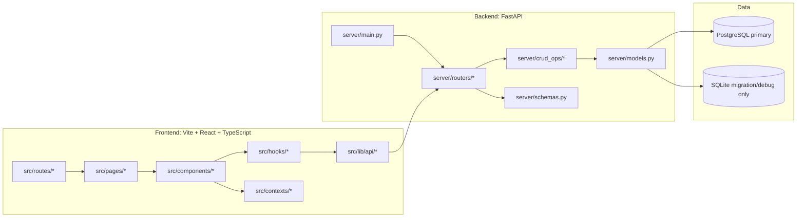
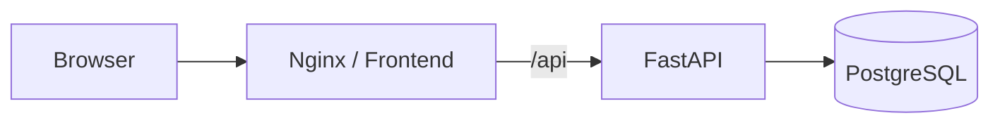

# 系統架構
最後更新：2026-05-26（v0.5.0）

本文件描述目前線上架構與程式碼實際分層，對齊 `src/`、`server/` 與部署設定。

## 1. 高階架構

## 2. 前端分層
- 入口：`src/main.tsx`、`src/App.tsx`、`src/AppRouter.tsx`
- 路由：
  - `src/routes/PublicRoutes.tsx`
  - `src/routes/WorkspaceRoutes.tsx`
- 主要頁面：
  - Public：`PublicGalleryPage`、`PublicReaderPage`、`AuthorProfilePage`、`OrganizationPage`
  - Studio/Admin：`PublisherDashboard`、`SuperAdminPage`
- 共享狀態：
  - `SettingsContext`（外觀、閱讀、V2 開關）
  - `MarkerThemeContext`（標記主題與 layoutConfig）
  - `AuthContext`（登入狀態與權限）

## 3. 多欄模式（V2）實作原則
- V2 版面結構由 `layoutConfig`（每個主題獨立）控制。
- 「是否啟用多欄渲染」為**主題別設定**（theme-scoped），不是全域單一開關。
- 渲染器：`src/components/renderer/v2/*`
- 版面與路由語意：`src/lib/v2/*`

## 4. 標記主題與系統預設
- 主題管理：`src/hooks/useMarkerThemes.ts`
- 系統預設（default theme）來源：
  - 公開讀取：`GET /api/default-marker-configs`
  - 管理讀寫：`GET/PUT /api/admin/default-marker-configs`
- 權限：只有超級管理員可修改系統預設。

## 5. 後端分層與關鍵路由
- Public：`server/routers/public.py`、`public_bundle.py`
- Studio：`scripts.py`、`personas.py`、`orgs.py`、`series.py`、`tags.py`
- Admin：`admin.py`
- Export/Analysis：`export.py`、`analysis.py`
- 認證入口：`server/dependencies.py:get_current_user_id`

## 6. 部署拓樸

- 開發 Compose：`docker-compose.dev.yml`
- 正式 Compose：`docker-compose.prod.yml`
- 反向代理：`nginx.conf`

## 7. 維護同步規則
新增功能時，至少同步檢查：
- 前端 API 封裝：`src/lib/api/*`
- 後端 route：`server/routers/*`
- CRUD/模型/schema：`server/crud_ops/*`、`server/models.py`、`server/schemas.py`
- 本文件與 `docs/product/data-flows.md`
