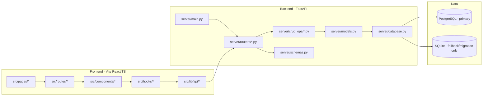
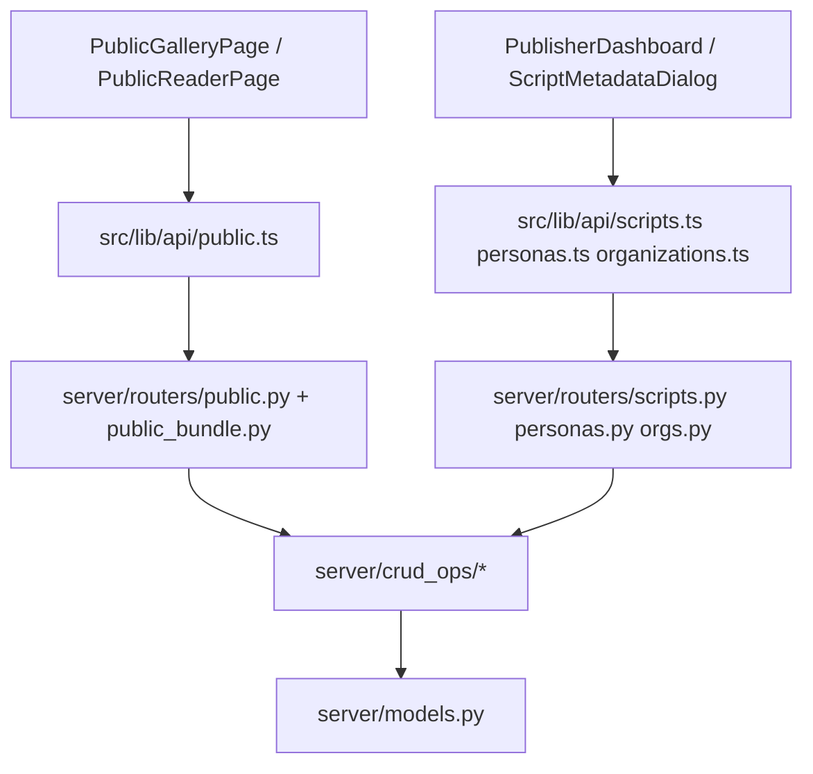
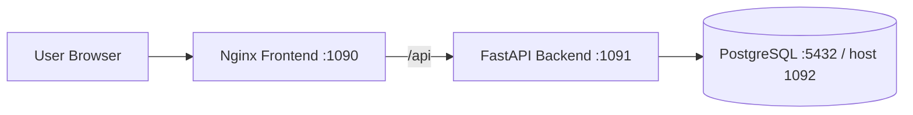

# 系統架構
最後更新：2026-05-15

本文件描述目前專案的實際程式架構，對齊 `src/`、`server/`、Docker 與現行 API 路徑。

## 1. 高階架構

## 2. 前端結構
- 入口：`src/main.tsx`
- 主應用：`src/App.tsx`、`src/AppRouter.tsx`
- 路由切分：`src/routes/PublicRoutes.tsx`、`src/routes/WorkspaceRoutes.tsx`
- 頁面層：`src/pages/`
- UI 與功能元件：`src/components/`
- 狀態與行為：`src/hooks/`、`src/contexts/`
- API 封裝：`src/lib/api/`（`client.ts` + domain APIs）
- 匯入/解析：`src/lib/importPipeline/`、`src/lib/screenplayAST.ts`
- 統計：`src/lib/statistics/`

## 3. 後端結構
- 入口與中介層：`server/main.py`
- 驗證/授權依賴：`server/dependencies.py`
- 路由層：`server/routers/`
  - 主要包含：`public.py`、`public_bundle.py`、`scripts.py`、`personas.py`、`orgs.py`、`series.py`、`tags.py`、`analysis.py`、`media.py`、`admin.py`
- 業務邏輯與資料操作：`server/crud_ops/`
- 資料模型：`server/models.py`
- 回傳結構：`server/schemas.py`
- 分析服務：`server/analysis/analyzer.py`

## 4. 主要請求路徑

## 5. 認證與 API Base
- 前端 API Base：`src/lib/api/client.ts` 讀取 `VITE_API_URL`，未設定時預設 `/api`。
- 正式/同源場景：由 Nginx 反向代理 `/api` 至後端。
- 認證：
  - 正式：`Authorization: Bearer <Firebase ID Token>`
  - 本機選用：`X-User-ID`（由環境變數控制）
- 後端驗證入口：`server/dependencies.py:get_current_user_id`

## 6. 資料庫與遷移策略
- 正式主用資料庫：PostgreSQL
- SQLite 僅保留於：
  - 歷史資料轉移來源
  - 本機臨時除錯
- 啟動開關：
  - `DB_AUTO_CREATE_TABLES`
  - `DB_RUN_LEGACY_MIGRATIONS`
- 轉移腳本：`server/migrate_sqlite_to_postgres.py`

## 7. 部署拓樸

對應檔案：
- 開發：`docker-compose.dev.yml`
- 正式：`docker-compose.prod.yml`
- 反代規則：`nginx.conf`

## 8. 維護規則
- 新增 API 時，需同步更新：
  - `src/lib/api/*`
  - `server/routers/*`
  - `server/crud_ops/*`（如需資料存取）
  - 本文件第 4 節（主要請求路徑）
- 新增資料欄位時，需同步更新：
  - `server/models.py`
  - `server/schemas.py`
  - 對應前端表單與顯示元件
