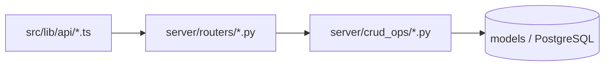

# 核心資料流
最後更新：2026-05-26（v0.5.0）

本文件聚焦目前版本的主要功能資料流，描述「前端入口 -> API -> 後端路由 -> CRUD/模型」。

## 1. 通用主幹

## 2. Public Gallery
- 前端：`src/pages/PublicGalleryPage.tsx`
- API：`src/lib/api/public.ts#getPublicBundle`
- 後端：`GET /api/public-bundle`（`public_bundle.py`）
- 資料：公開 scripts/personas/organizations + terms/banner

## 3. Public Reader
- 前端：`src/pages/PublicReaderPage.tsx`
- API：`src/lib/api/public.ts#getPublicScript`
- 後端：`GET /api/public-scripts/{id}`（`public.py`）
- 顯示：`PublicReaderLayout` + `PublicScriptInfoOverlay`

## 4. Studio（作品/作者/組織）
- 前端：`src/pages/PublisherDashboard.tsx`
- API：`scripts.ts` / `personas.ts` / `organizations.ts` / `series.ts`
- 後端：`scripts.py`、`personas.py`、`orgs.py`、`series.py`
- 資料：Script、Persona、Organization、Series

## 5. Script Metadata 編輯
- 前端：`ScriptMetadataDialog.tsx`
- 讀取：`GET /api/scripts/{id}`
- 儲存：`PUT /api/scripts/{id}`
- 後端：`scripts.py -> crud_ops/scripts_*`
- 備註：v0.5.0 後 metadata 與部分媒體裁切資訊以結構化欄位為主。

## 6. Marker Theme 與 V2 多欄設定
- 主題列表/CRUD：`/api/themes*`
- 系統預設標記：
  - Public read：`GET /api/default-marker-configs`
  - Admin read/write：`GET/PUT /api/admin/default-marker-configs`
- V2 版面：每個主題帶 `layoutConfig`
- V2 開關：每個主題獨立（theme-scoped）

## 7. Super Admin 管理流
- 前端：`src/pages/SuperAdminPage.tsx`
- API：`src/lib/api/admin.ts`
- 後端：`server/routers/admin.py`
- 功能：
  - 管理員帳號管理
  - 全域用戶/組織/角色/作品查詢與刪除
  - 系統預設標記規則讀寫
  - 公開條款簽署紀錄查詢

## 8. 匯出與分析
- 匯出：`server/routers/export.py`（Google Docs / 報表等）
- 分析：`server/routers/analysis.py`
- 前端統計：`src/lib/statistics/*` + `StatisticsPanel`

## 9. 認證與授權資料流

## 10. 版本維護建議
每次改動以下任一類功能，都要同步更新：
- `docs/product/architecture.md`
- 本文件（`docs/product/data-flows.md`）
- 對應 API 封裝與 route 文件
