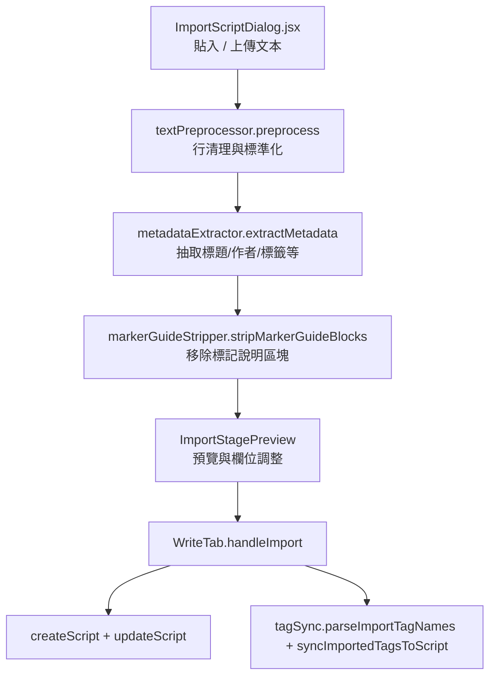

# 腳本匯入流程（現況）
最後更新：2026-03-11

本文件描述目前實際上線的匯入流程（非規劃稿）。

## 流程總覽

## 主要檔案
- `src/components/dashboard/write/ImportScriptDialog.jsx`
- `src/components/dashboard/write/import/ImportStagePreview.jsx`
- `src/lib/importPipeline/textPreprocessor.js`
- `src/lib/importPipeline/metadataExtractor.js`
- `src/lib/importPipeline/markerGuideStripper.js`
- `src/lib/importPipeline/tagSync.js`
- `src/components/dashboard/WriteTab.jsx`

## 階段說明
1. 輸入與預處理
`ImportScriptDialog` 接收原文後，先呼叫 `preprocess()` 清理空白與格式噪音。

2. Metadata 解析
`extractMetadata()` 會從「開頭 metadata 區塊」抽取欄位，不再深入正文掃描。
已修正重點：
- 遇到正文樣式（如 `#C`）即停止 metadata 掃描
- 避免尾端 `標籤:...` 反向吞掉正文
- `fallback title` 不再把 marker 行誤判為標題

3. 匯入預覽與手動調整
`ImportStagePreview` 顯示解析後欄位（標題、角色、章節等），可在匯入前調整。

4. 建立腳本與標籤同步
`WriteTab.handleImport`：
- `createScript` 建立草稿
- `updateScript` 寫入內容與 custom metadata
- `tagSync` 解析匯入標籤並同步到「實體 tag 關聯」

## 與舊版流程差異
- 不再使用 `src/lib/metadataParser.js`
- 匯入流程不使用 `markerDiscoverer.js`（該規劃稿未採用）
- `Tags` 匯入後優先同步為 script tags，不再混入 custom metadata

## 相關測試
- `src/lib/importPipeline/metadataExtractor.test.js`
- `src/lib/importPipeline/tagSync.test.js`
- `src/components/dashboard/write/ImportScriptDialog.metadata.test.js`
- `src/components/dashboard/WriteTab.test.jsx`
