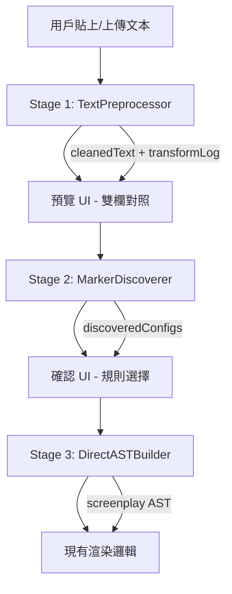

# 三階段式腳本匯入處理系統

> 建立時間：2026-01-30  
> 狀態：規劃中

## 概述

本文件描述一個三階段式的腳本匯入處理流程，用於將各種格式的台本文本轉換為結構化的 AST。



---

## Stage 1: TextPreprocessor

### 目標
- 將被複製貼上後格式亂掉的文本「接」回正確的行
- 統一全形/半形符號
- 保留原始資訊以便回溯

### 設計

#### 接行策略分級

| 確信度 | 行為 | 範例 |
|--------|------|------|
| 高 | 自動接行 | `#SE\n門外的鑰匙聲` → `#SE 門外的鑰匙聲` |
| 中 | 接行但標記 | 角色名後接括號 |
| 低 | 不接行，高亮提示 | 可能是刻意換行 |

#### 符號正規化表

| 原始 | 正規化 | 備註 |
|------|--------|------|
| `＠` | `@` | 全形轉半形 |
| `＊` | `*` | 全形轉半形 |
| `（` / `）` | 保留 | 括號保留全形（語意不同） |
| `>>>SE` | `>>SE` | 統一格式（可選） |

#### 輸出格式

```javascript
{
  cleanedText: "處理後的文本",
  originalText: "原始文本",
  transformLog: [
    { 
      line: 5, 
      type: "join", 
      from: "#SE\n門外的鑰匙聲", 
      to: "#SE 門外的鑰匙聲",
      confidence: "high"
    },
    { 
      line: 10, 
      type: "normalize", 
      from: "＠", 
      to: "@" 
    }
  ],
  manualReviewNeeded: [
    { line: 75, reason: "可能是刻意換行" }
  ]
}
```

---

## Stage 2: MarkerDiscoverer

### 目標
- 自動偵測文件中使用的標記模式
- 輸出符合 `markerConfigs` 格式的建議設定
- 讓使用者確認後套用

### Pattern 掃描策略

#### 1. Prefix 模式偵測
掃描行首出現的特殊符號或固定前綴：
- `#SE`, `@`, `>>SE`, `<<SE`, `//BG`, `\\BG`
- `▼`, `▲`, `☆`

#### 2. Enclosure 模式偵測
掃描成對出現的符號：
- `（...）`, `【...】`, `《...》`
- `＜...＞`, `{{...}}`, `((...))`, `<<...>>`

#### 輸出格式

```javascript
{
  discoveredMarkers: [
    {
      // 符合現有 markerConfig 結構
      id: 'sfx_se',
      label: '效果音 (#SE)',
      start: '#SE',
      end: '',
      isBlock: true,
      type: 'prefix',
      matchMode: 'prefix',
      style: { fontWeight: 'bold', color: '#eab308' },
      
      // 偵測 metadata（不存入最終設定）
      _discovery: {
        confidence: 0.95,
        occurrences: 12,
        examples: [
          { line: 65, text: '#SE 門外的鑰匙聲' },
          { line: 67, text: '#SE 用鑰匙開鎖的聲音' }
        ]
      }
    }
  ],
  conflicts: [
    {
      description: "偵測到的 （...） 可能與現有「括號與距離」規則衝突",
      existingRule: "paren",
      discoveredPattern: "（...）"
    }
  ],
  ambiguities: [
    {
      description: "無法確定 ＊ 開頭是否為獨立標記",
      lines: [185, 233, 281]
    }
  ]
}
```

---

## Stage 3: DirectASTBuilder

### 目標
- 繞過 Fountain.js，直接從清洗後的文本建構 AST
- 利用已確認的 `markerConfigs` 進行解析
- 整合現有的 `parseInline` 邏輯

### AST 節點類型

| 類型 | 說明 | 來源判斷 |
|------|------|---------|
| `chapter` | 章節 | 匹配 `01.` 或 `Chapter` 開頭 |
| `character` | 角色名 | 獨立行、大多為中文名、後接對話 |
| `dialogue` | 對話 | 在角色名之後的文本 |
| `action` | 動作/描述 | 非標記、非對話的文本 |
| `marker` | 自訂標記 | 匹配 markerConfigs 中的規則 |
| `blank` | 空行 | 純空白行 |

### 建構流程

```javascript
class DirectASTBuilder {
  constructor(markerConfigs) {
    this.configs = markerConfigs;
  }

  parse(cleanedText) {
    const lines = cleanedText.split('\n');
    const ast = { type: 'screenplay', children: [] };
    
    let context = {
      currentChapter: null,
      currentCharacter: null
    };
    
    for (let i = 0; i < lines.length; i++) {
      const node = this.parseLine(lines[i], i, context);
      if (node) {
        this.updateContext(node, context);
        ast.children.push(node);
      }
    }
    
    return ast;
  }
}
```

---

## 檔案結構

```
src/lib/importPipeline/
├── index.js                 # 匯出主要 API
├── textPreprocessor.js      # Stage 1
├── textPreprocessor.test.js
├── markerDiscoverer.js      # Stage 2
├── markerDiscoverer.test.js
├── directASTBuilder.js      # Stage 3
├── directASTBuilder.test.js
└── constants.js             # 共用常數（接行規則、符號對照表等）
```

---

## 預計變更檔案

### [NEW] `src/lib/importPipeline/textPreprocessor.js`
- 實作 `TextPreprocessor` class
- 匯出 `preprocess(text)` 函數

### [NEW] `src/lib/importPipeline/markerDiscoverer.js`
- 實作 `MarkerDiscoverer` class
- 匯出 `discoverMarkers(text, existingConfigs)` 函數

### [NEW] `src/lib/importPipeline/directASTBuilder.js`
- 實作 `DirectASTBuilder` class
- 匯出 `buildAST(text, markerConfigs)` 函數

### [NEW] `src/lib/importPipeline/constants.js`
- 接行規則定義
- 符號正規化對照表
- 預設 pattern 清單

### [MODIFY] `src/components/dashboard/write/ImportScriptDialog.jsx`
- 整合新的三階段流程
- 新增預覽與確認 UI

---

## 驗證計畫

### 自動化測試

使用 Node.js test runner (`node --test`) 執行：

```bash
# 執行所有新增的測試
node --test src/lib/importPipeline/*.test.js
```

#### 測試案例

1. **TextPreprocessor 測試**
   - 高確信度接行測試（#SE 後接內容）
   - 符號正規化測試（＠ → @）
   - 保留刻意換行測試

2. **MarkerDiscoverer 測試**
   - 偵測 prefix 模式（#SE, @）
   - 偵測 enclosure 模式（（...））
   - 偵測衝突情況

3. **DirectASTBuilder 測試**
   - 基本 AST 結構建構
   - 角色名與對話配對
   - 自訂標記解析

### 手動驗證

使用專案中的範例檔案測試：

1. 開啟 http://localhost:5173
2. 進入「寫作」頁面
3. 點擊「匯入腳本」
4. 分別貼上 `convert_example/file1`、`file2`、`file3` 的內容
5. 確認：
   - 預覽畫面正確顯示清洗後的結果
   - 偵測到的標記規則與文件內容相符
   - 最終 AST 正確渲染

---

## 風險與緩解

| 風險 | 緩解措施 |
|------|---------|
| 接行邏輯誤判 | 提供「保守模式」，只接高確信度行 |
| 標記偵測誤判 | 要求使用者確認，不自動套用 |
| 與現有規則衝突 | 在 UI 中明確警告，提供合併選項 |
| 效能問題（長文本） | 使用串流處理，逐行解析 |
